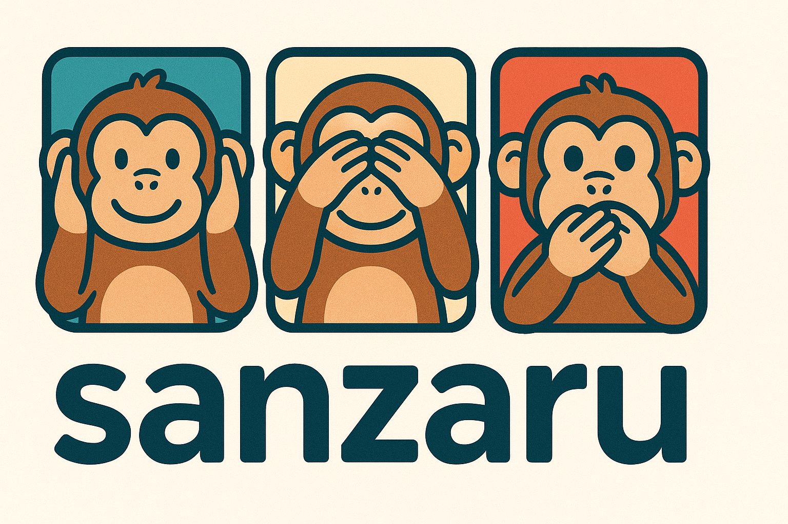

# sanzaru

<div align="center">
  
</div>

A **stateless**, lightweight **MCP** server that wraps **OpenAI's Sora Video API, Whisper, and GPT-4o Audio APIs** via the OpenAI Python SDK.

## Features

### Video Generation (Sora)
- **Video Generation**: Create Sora jobs (`sora-2` / `sora-2-pro`), optional image reference, optional remix
- Get status, wait until completion (polling), download assets
- List and delete videos
- Remix existing videos

### Image Generation
- **Image Generation**: Create reference images using GPT-5/GPT-4.1 with iterative refinement
- List and prepare reference images
- Reference image management with automatic resizing

### Audio Processing
- **Audio Transcription**: Whisper and GPT-4o transcription models
- **Audio Chat**: Interactive audio analysis with GPT-4o
- **Text-to-Speech**: High-quality TTS with multiple voices
- **Audio Processing**: Format conversion, compression, file management
- **Enhanced Transcription**: Specialized templates for detailed, storytelling, professional, or analytical output

**Architecture:** Stateless by default; no DB, no in-memory job tracking

> **Note:** Content guardrails are enforced by OpenAI. This server does not run local moderation.

## Performance

The server is **fully asynchronous** with proven concurrency at scale:
- ✅ **32+ concurrent downloads** verified in stress testing
- ✅ **8-10x speedup** for parallel operations (image processing, file I/O, base64 decoding)
- ✅ **Non-blocking architecture** using `aiofiles` + `anyio` thread pools
- ✅ **Python 3.14 ready** - Optimized for free-threading support

See [`docs/async-optimizations.md`](docs/async-optimizations.md) for technical details and benchmarks.

## Requirements
- Python 3.10+
- `OPENAI_API_KEY` environment variable

**Feature-specific environment variables:**
- `VIDEO_PATH` - Directory for downloaded videos (required for video features)
- `IMAGE_PATH` - Directory for reference images (required for image features)
- `AUDIO_FILES_PATH` - Directory containing audio files (required for audio features)

## Installation

### Base Installation (Video + Image)
```bash
uv add sanzaru
```

### With Audio Support
```bash
uv add "sanzaru[audio]"
```

### All Features
```bash
uv add "sanzaru[all]"
```

### Development Installation
```bash
git clone https://github.com/TJC-LP/sanzaru.git
cd sanzaru
uv sync --all-extras
```

## Quick Start

1. **Clone the repository:**
   ```bash
   git clone https://github.com/TJC-LP/sanzaru.git
   cd sanzaru
   ```

2. **Run the setup script:**
   ```bash
   ./setup.sh
   ```
   The script will:
   - Prompt for your OpenAI API key with hidden input (or use `$OPENAI_API_KEY` if set)
   - Create default directories with absolute paths in project root
   - Generate `.env` configuration file
   - Install dependencies with `uv sync`

3. **Start generating videos:**
   ```bash
   claude
   ```

That's it! Claude Code will automatically connect to the sanzaru MCP server and you can start generating videos.

## Alternative Installation Methods

**Claude Desktop:**
Add the following to your `claude_desktop_config.json`

```json
{
  "mcpServers": {
    "sanzaru": {
      "command": "uv",
      "args": [
        "run",
        "--directory",
        "/path/to/repo",
        "sanzaru"
      ]
    }
  }
}
```

**Codex MCP Setup:**
```bash
# From the repo root
codex mcp add sanzaru -- uv run --directory "$(pwd)" sanzaru
```
Ensure your `.env` is configured or relevant env vars are exported before starting.

## Manual Installation (without Claude Code)

If you want to run the server manually or integrate it with other MCP clients:

```bash
uv venv
uv sync

# Set environment variables and run
export OPENAI_API_KEY=sk-...
export VIDEO_PATH=~/videos
export IMAGE_PATH=~/images
export AUDIO_FILES_PATH=~/audio
uv run sanzaru
```

**Important:** Environment variables are required for the features you want to use. The directories must exist before starting the server.

## MCP Tools

This runs an MCP server over stdio that exposes these tools:

### Video Generation
- `create_video(prompt, model="sora-2", seconds?, size?, input_reference_filename?)`
  - Note: `seconds` must be a string: `"4"`, `"8"`, or `"12"` (not an integer)
  - Note: `size` must be one of: `"720x1280"`, `"1280x720"`, `"1024x1792"`, `"1792x1024"`
  - Note: `model` must be one of: `"sora-2"`, `"sora-2-pro"`
  - Note: `input_reference_filename` is a filename (not path) from `IMAGE_PATH`
- `get_video_status(video_id)` - Returns Video object with status/progress
- `download_video(video_id, filename?, variant="video")` - Downloads to `VIDEO_PATH`
  - `filename` is optional - defaults to `{video_id}.{extension}` if not provided
  - Example: `download_video(video_id, filename="my_video.mp4")`
- `list_videos(limit=20, after?, order="desc")` - Returns paginated list of videos
- `delete_video(video_id)` - Deletes video from OpenAI storage
- `remix_video(previous_video_id, prompt)` - Creates a remix

### Image Generation
- `create_image(prompt, model="gpt-5", size?, quality?, output_format?, background?, previous_response_id?)` - Generate images with GPT-5/GPT-4.1
  - Supported sizes: `1024x1024`, `1024x1536`, `1536x1024`, or `auto`
- `get_image_status(response_id)` - Check image generation status
- `download_image(response_id, filename?)` - Download completed image to `IMAGE_PATH`

### Reference Image Management
- `list_reference_images(pattern?, file_type="all", sort_by="modified", order="desc", limit=50)` - Search reference images
- `prepare_reference_image(input_filename, target_size, output_filename?, resize_mode="crop")` - Resize images to match Sora dimensions

> **Note:** To wait for completion, poll `get_video_status` or `get_image_status` periodically rather than blocking. This keeps the LLM session responsive.

## Prompting Guide
For practical tips and examples to craft effective Sora prompts, see `docs/sora2-prompting-guide.md`.

## Download variants
- `variant="video"` → `mp4`
- `variant="thumbnail"` → `webp`
- `variant="spritesheet"` → `jpg`

## Reference Images
- Supported formats: JPEG, PNG, WEBP
- Place reference images in `IMAGE_PATH` directory
- Use `list_reference_images` to discover available images
- Reference image dimensions must match target video `size` parameter
- LLMs can only access images in the configured reference directory (security sandbox)

### Automatic Image Resizing
Use `prepare_reference_image` to automatically resize any image to match Sora's required dimensions:

**Workflow:**
1. List available images: `list_reference_images()`
2. Prepare image: `prepare_reference_image("photo.jpg", "1280x720", resize_mode="crop")`
3. Create video: `create_video(prompt="...", size="1280x720", input_reference_filename="photo_1280x720.png")`

**Resize modes:**
- `crop` (default): Scale to cover target dimensions, center crop excess. No distortion, but may lose edges.
- `pad`: Scale to fit inside target, add black letterbox bars. No distortion, preserves full image.
- `rescale`: Stretch/squash to exact dimensions. May distort image, but uses full canvas with no cropping or padding.

The original image is preserved; a new resized PNG is created with dimensions in the filename.

## Image Generation

Generate reference images using OpenAI's Responses API with GPT-5 or GPT-4.1 models. Images are automatically saved to `IMAGE_PATH` for use with Sora video generation.

### Basic Workflow
```
1. create_image(prompt="sunset over mountains") -> response_id
2. get_image_status(response_id) -> poll until status='completed'
3. download_image(response_id, filename="sunset.png")
4. create_video(prompt="...", input_reference_filename="sunset.png")
```

### Iterative Refinement
Use `previous_response_id` to refine images conversationally:
```
1. resp1 = create_image(prompt="a cat")
2. Wait for completion with get_image_status(resp1.id)
3. resp2 = create_image(prompt="make it more realistic", previous_response_id=resp1.id)
4. Wait for completion with get_image_status(resp2.id)
5. download_image(resp2.id, filename="realistic_cat.png")
```

### Parameters
- **model**: `gpt-5` (default), `gpt-4.1`, or other models with image generation support
- **size**: `auto` (default), `1024x1024`, `1024x1536`, `1536x1024`
- **quality**: `high` (default), `low`, `medium`, `auto`
- **output_format**: `png` (default), `jpeg`, `webp`
- **background**: `auto` (default), `transparent`, `opaque`

### Combined Workflow
Generate a reference image and create a video from it:
```
1. create_image(prompt="futuristic cityscape at night", size="1280x720")
2. Poll with get_image_status until completed
3. download_image with custom filename
4. create_video using the generated reference image
```

## Notes
- Download URLs from OpenAI are time-limited
- Videos are automatically saved to `VIDEO_PATH` when downloaded

## License
[MIT](LICENSE)
